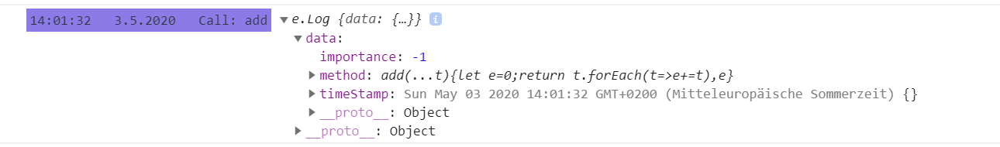
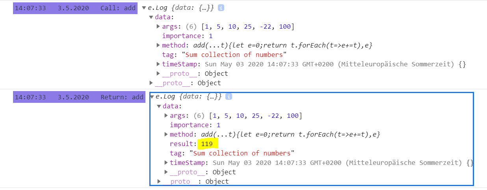
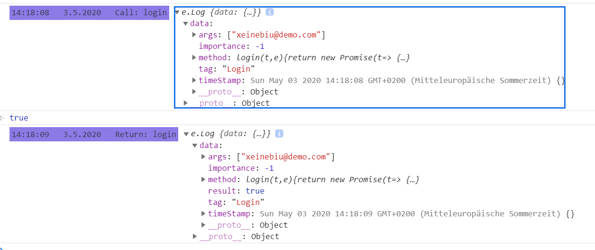
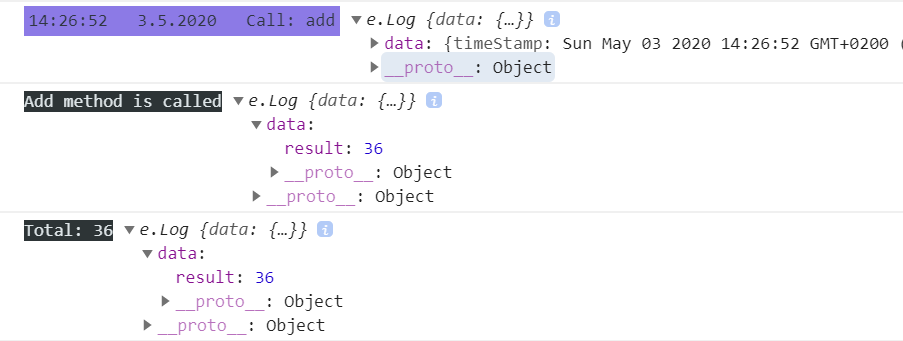

## Logger for Typescript

Enable logging on your TS Project using decorators|annotations.

---

### Installation

````bash
npm i @xeinebiu/ts-logger@1.1.0
````

---

### Change Logs

    1.1.0
        - Add LogClass Decorator
    1.0.1
        - Fix module exports
    1.0.0
        - Initial Version

### Usage

---

#### Logger

Setting the ``listner`` is necessary to enable the logging.

````javascript
Logger.listener = {
    // Return True to output the given [log], false otherwise
    beforeLog: (log: Log, outputType: OutputType) => {
        return true;
    },

    // The given [log] is printed
    afterLog: (log: Log, outputType: OutputType) => {

    },

    // Apply different styles of [Log] and [outputType]
    applyStyle: (log: Log, outputType: OutputType) => {
        if (outputType === OutputType.log) {
            return 'background: #8c7ae6; color: #2f3640; padding: 3px';
        }
        return true;
    }
};
````

---

#### Method Logger

To log any method, use ``@Method.Log()`` decorator and `@Method.asyncLong()` for Asynchronous Methods.

Assume we have a class called ``Demo`` and we want to log some methods on it.

````javascript
class Demo {
    @Method.log()
    public add(...args: number[]): number {
        let sum = 0;
        args.forEach(x => sum += x);
        return sum;
    }
}
````

Now, every time the method ``add(..args)`` is invoked, an output will result in console like the below


##### MethodLoggerOptions

The decorator ``@Method.log()`` accepts an `MethodLoggerOptions` as single argument where we can configure the Logger
for each Method.

````javascript
    @Method.log({tag: 'Sum collection of numbers', args: true, importance: 1, printResult: true})
public
add(...args
:
number[]
):
number
{
    let sum = 0;
    args.forEach(x => sum += x);
    return sum;
}
````

With the above configuration, we are about to see 2 logs for the same method call. First Log when the method is invoked,
and the second when Return.


Arguments can be printed partially also.

````javascript
    @Method.asyncLog({tag: 'Login', printResult: true, args: [0]})
public
login(username
:
string, password
:
string
):
Promise < boolean > {
    return new Promise < boolean > ((resolve) => {
        setTimeout(() => resolve(true), 1000);
    });
}
````



---

##### Injector

Injector can be used when Logging from inside of method is needed. Inject as last argument, the ``Logger`` and set it
to `optional`.

````javascript
    @Method.log({inject: true})
public
add(args
:
number[], logger ? : Logger
):
number
{
    logger.debug('Add method is called');
    let sum = 0;
    args.forEach(x => sum += x);
    logger.params.data.result = sum;
    logger.debug(`Total: ${sum}`);
    return sum;
}
````



#### Filter

Filter of logs can be done from the Listener ``beforeLog()`` callback.

````javascript
beforeLog: (log: Log, outputType: OutputType) => {
    return log.data.importance
    ! > 2 && outputType === OutputType.debug;
},
...
````

> Outputs only the Logs with importance greater than ``2`` and of type `debug`

````javascript
beforeLog: (log: Log, outputType: OutputType) => {
    return log.data.tag === 'login';
},
...
````

> Outputs only the logs with the Tag `login`

Depending on your needs, filter can be done on many ways as it needed.

### Author

> xeinebiu
